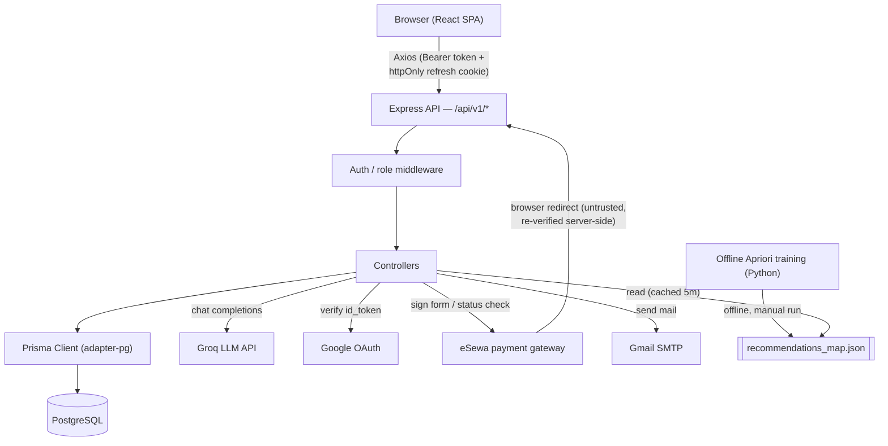
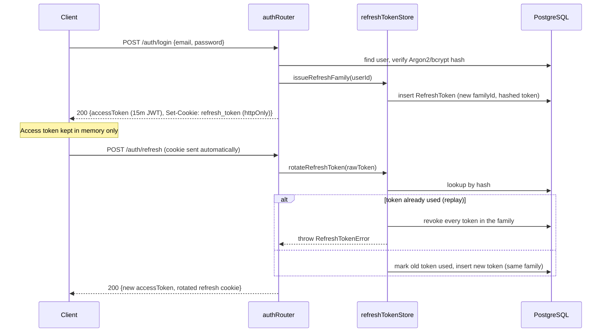
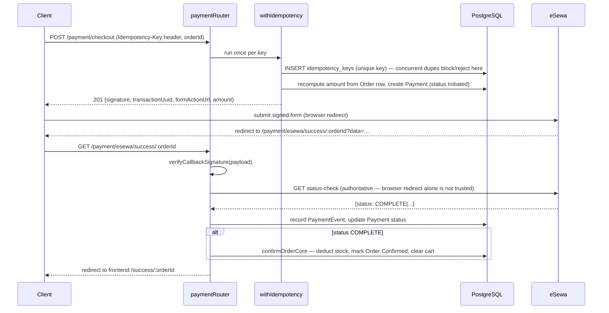
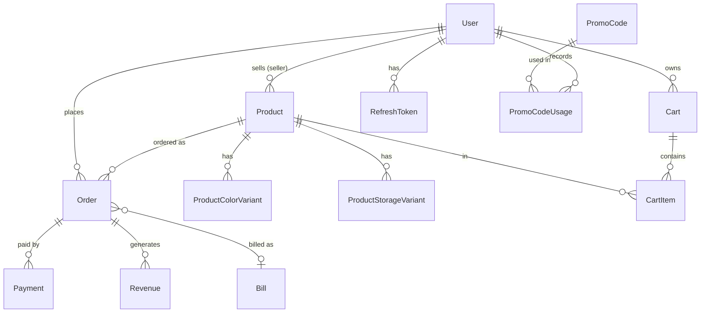

# ShopSphere

A multi-vendor e-commerce marketplace for Apple-product resale in Nepal, built with React, Express, PostgreSQL/Prisma, and the eSewa payment gateway.

## Overview

ShopSphere is a marketplace connecting independent sellers of Apple hardware and accessories with customers, under admin oversight. It supports three roles — customer, seller, and admin — each with a distinct set of flows: customers browse, buy, and track orders; sellers manage inventory and fulfill orders once verified by an admin; admins approve sellers, moderate promo codes, and review platform-wide revenue.

Technically, the project is interesting less for its CRUD surface and more for how it handles the parts of an e-commerce system that are easy to get wrong:

- **Payments** go through eSewa, a gateway with no server-to-server webhook — the app treats the browser redirect as untrusted and re-verifies every transaction against eSewa's own status-check API before confirming an order.
- **Checkout is idempotent** — a client-supplied `Idempotency-Key` plus a unique DB constraint (not an in-memory lock) makes concurrent duplicate checkout requests safe, so a flaky network retry can't double-charge a customer or double-decrement stock.
- **Auth uses rotating refresh-token families** with reuse detection: a replayed refresh token doesn't just fail, it revokes every token issued in that session, which is the standard signal for a stolen token.
- **The database was migrated from MongoDB to PostgreSQL/Prisma mid-project** (see [backend/scripts/migrateMongoToPostgres.js](backend/scripts/migrateMongoToPostgres.js)), and every primary key still reuses the original Mongo ObjectId hex string so existing JWTs and cached client-side ids kept working across the cutover.

## Key Features

**Implemented**
- **MCP public-read service** — a separately runnable authenticated Streamable HTTP process pinned to protocol `2025-11-25`; seven strict catalog/policy tools call a fixed authenticated Express assistant API and remain disabled by default until the public-pilot gate is complete
- **Authentication & authorization** — email/password with Argon2id hashing (bcrypt-verified legacy accounts auto-upgrade on login), rotating refresh tokens with stolen-token detection, Google Sign-In, role-based access (customer / seller / admin)
- **Multi-vendor catalog** — product CRUD with per-color and per-storage stock variants, image uploads, product reviews
- **Cart & checkout** — persistent server-side cart, promo code discounts, single and bulk (multi-item) order creation
- **Payments** — eSewa v2 integration: server-side HMAC-signed checkout, signature-verified callback, authoritative status-check confirmation, append-only payment event ledger, idempotent checkout endpoint
- **Order lifecycle** — Pending → Confirmed → Processing → Shipped → Delivered, plus Cancel, Return Request, Return Approve/Reject, and Refund Release, with a customer-facing tracking timeline
- **Promo codes** — admin-managed codes with usage limits, min-purchase and max-discount rules, per-user usage tracking, and broadcast notifications on creation
- **Revenue reporting** — monthly/total revenue for sellers and admins, computed from a per-order 5% platform commission
- **Product recommendations** — "frequently bought together" served from a pre-trained Apriori (market-basket) model, with fuzzy name matching and an in-memory 5-minute cache
- **AI chat assistant** — Groq-backed (Llama 3.1) widget grounded in live product/stock data and a static FAQ file, scoped to store-related questions only
- **In-app notifications** — low-stock alerts to sellers, new-product and promo broadcasts to customers
- **Transactional email** — order confirmations, status updates, seller approval/rejection, via Nodemailer/Gmail

**Partially implemented**
- **Pagination** on the four previously-unbounded list endpoints (`getProducts`, `getAllOrder`, `getAllUsers`, `getAllUsersAndSellers`) is opt-in via `?page=&limit=` query params — the response switches from a bare array to `{ items, total, page, pageSize }` only when those params are present, so existing callers that don't pass them keep the old shape (now capped at 1000 rows instead of truly unbounded). No frontend page currently passes those params yet.
- **Input validation** with `zod` now covers the money-handling and content-creation endpoints (auth, orders, cart, products, promo codes) but not every controller — revenue and user-management routes still do light manual checks rather than full schemas.

**Not currently implemented**
- CSRF token — the refresh cookie is `SameSite=strict`, which modern browsers already refuse to send cross-site, so a dedicated token would be marginal defense-in-depth rather than closing a real gap.
- A shared (e.g. Redis-backed) rate-limiter store — `express-rate-limit`'s default in-memory store resets per process, so the auth rate limit isn't actually shared once the API runs as more than one instance.

## Tech Stack

| Layer | Technology | Purpose |
|---|---|---|
| Frontend | React 18 + TypeScript + Vite | SPA, route-level code splitting via `React.lazy` |
| Frontend | React Router 6 (`HashRouter`) | Client-side routing without server rewrite rules |
| Frontend | Tailwind CSS + Radix UI primitives | Styling and accessible component primitives |
| Frontend | Axios | HTTP client with token-refresh interceptor |
| Frontend | Recharts | Admin/seller revenue dashboards |
| Frontend | Sonner | Toast notifications |
| Backend | Node.js + Express 4 | REST API |
| Backend | Prisma ORM 7 + `@prisma/adapter-pg` | Type-safe DB access over a `pg` driver adapter |
| Database | PostgreSQL | Primary datastore |
| Auth | `jsonwebtoken` (access tokens), opaque hashed tokens (refresh) | Short-lived JWT + rotating refresh-token families |
| Auth | `@node-rs/argon2` + `bcryptjs` | Password hashing (Argon2id, with bcrypt read-path for legacy accounts) |
| Auth | `google-auth-library` + `@react-oauth/google` | Google Sign-In |
| Payments | Custom eSewa v2 integration (`crypto` HMAC-SHA256) | Signed checkout form, verified callback, status reconciliation |
| AI | `groq-sdk` (Llama 3.1 8B) | Store-scoped chat assistant |
| Recommendations | Python (pandas / mlxtend-style Apriori script) | Offline market-basket training, consumed as a static JSON file |
| Email | Nodemailer (Gmail SMTP) | Transactional email |
| Testing | Node.js built-in test runner (`node --test`) | Backend unit tests |
| Testing | Vitest + React Testing Library | Frontend component tests |
| Infrastructure | Docker Compose | Postgres, backend, and frontend, all three containerized |
| Infrastructure | GitHub Actions | CI: backend test suite, frontend test suite + build |

## System Architecture



- **React SPA** — all pages are lazy-loaded; the access token lives only in module memory (`lib/session.ts`), never `localStorage`, and is re-acquired from the httpOnly refresh cookie on hard reload.
- **Express API** — one router per domain (`auth`, `product`, `order`, `payment`, `cart`, `revenue`, `users`, `chat`, `notifications`, `promo`), all mounted under `/api/v1`.
- **Middleware** — `authenticate` (JWT verification), `authorizeAdmin` / `authorizeSeller` (role checks), `checkSellerVerification` (blocks unverified sellers from catalog writes).
- **Prisma + PostgreSQL** — the only live datastore; a legacy Mongoose/MongoDB layer (`backend/models/*.js`) still exists in the repo but is used solely by the one-time migration script, not by the running application.
- **eSewa** — the gateway has no server push webhook, so the browser's success/failure redirect is treated as a hint only; the actual confirmation is a server-to-server status-check call (see [How the System Works](#how-the-system-works)).
- **Recommendations** — a standalone Python pipeline (`backend/recommendation/train_apriori.py`) is run manually against a transaction CSV and produces `recommendations_map.json`, which both the product controller and the chat assistant read and cache in-memory.

## Project Structure

```text
Shopsphere/
├── backend/
│   ├── app.js                    Express app: CORS, body parsing, router mounts
│   ├── server.js                 Entry point: DB connect → listen, graceful shutdown
│   ├── controller/                Route handlers (business logic lives here)
│   ├── routes/                    Express routers, one per domain, mounted under /api/v1
│   ├── middlewares/                authMiddleware.js (JWT + roles), error.js (central handler)
│   ├── database/                   prismaClient.js (adapter-pg setup), dbConnection.js (init + seed)
│   ├── prisma/
│   │   ├── schema.prisma          Data model (see Database section)
│   │   └── migrations/             Versioned SQL migrations
│   ├── utils/                      tokens.js, refreshTokenStore.js, password.js, idempotency.js, esewa.js, seedAdmin.js, seedDemoData.js
│   ├── recommendation/             Python Apriori training pipeline (offline, not called at runtime)
│   ├── models/                     Legacy Mongoose schemas — used only by the Mongo→Postgres migration script
│   ├── scripts/                    migrateMongoToPostgres.js (one-time ETL)
│   └── chatbot/faqs.json           Static FAQ knowledge base for the chat assistant
├── frontend/
│   ├── src/pages/                  Route-level pages (customer, seller, admin)
│   ├── src/components/             Shared UI, auth, catalog, checkout, layout, operations
│   ├── src/lib/session.ts          In-memory access token + refresh/interceptor logic
│   └── src/test/                    Vitest setup and render helpers
├── mcp/                              Separate Streamable HTTP MCP service and policy registry
└── docker-compose.yml              Local PostgreSQL container
```

## How the System Works

### Login and token refresh



### Checkout and eSewa payment confirmation



Stock is intentionally deducted at **confirmation time**, not at order creation, so an abandoned or failed checkout never reduces available inventory.

## Authentication & Security

- **Access tokens** — JWT (`jsonwebtoken`), 15-minute expiry, payload `{ sub: userId, role, jti }`; the `jti` (random UUID per token) exists but is not currently checked against a blocklist.
- **Refresh tokens** — opaque 32-byte random values, never JWTs; only the SHA-256 hash is stored, so a DB read never exposes a usable token. Tokens are grouped by `familyId`; refreshing rotates the token (old one marked `usedAt`) and issues a new one in the same family.
- **Reuse detection** — presenting an already-used refresh token revokes every token in its family, treating replay as a stolen-token signal (see [refreshTokenStore.js](backend/utils/refreshTokenStore.js)).
- **Cookie** — refresh token is set `httpOnly`, `secure` in production, `sameSite: strict`, scoped to `path: /api/v1/auth` only.
- **Password hashing** — new passwords use Argon2id (`@node-rs/argon2`, explicit `memoryCost/timeCost/parallelism`); accounts with a pre-existing bcrypt hash still verify via bcrypt and are opportunistically rehashed to Argon2id on next successful login.
- **Google Sign-In** — server verifies the Google ID token via `google-auth-library` before creating/linking an account; never trusts client-asserted identity.
- **Rate limiting** — `express-rate-limit` on `/auth/register` and `/auth/login` only (20 requests / 15 minutes per IP).
- **Authorization** — `authenticate` (valid JWT required), `authorizeAdmin` / `authorizeSeller` (role checks), `checkSellerVerification` (blocks catalog writes until an admin approves the seller), plus per-resource ownership checks in controllers (e.g. a user can only cancel/return their own orders).
- **CORS** — explicit allow-list function (`app.js`) covering the configured frontend origin, localhost, LAN/hotspot IP ranges, and Capacitor's mobile WebView origin; everything else is rejected.
- **Not implemented** — no `helmet`/security-headers middleware, no CSRF token (relies on `SameSite=strict` + bearer-header auth rather than cookie-only auth), and request-body validation via `zod` is limited to register/login.

## Database

PostgreSQL, accessed through Prisma 7 with the `@prisma/adapter-pg` driver adapter (the connection string is read from `DATABASE_URL` via `prisma.config.ts`, not from `schema.prisma` directly).



Key entities:
- **User** — single table for customers, sellers, and admins (`role` column); sellers carry shop metadata and an `isVerified` admin-approval flag.
- **Product** — base stock plus normalized `ProductColorVariant` / `ProductStorageVariant` tables for per-variant stock tracking.
- **Order** — flattened delivery address and variant selections (previously embedded documents under MongoDB); `orderGroupId` links multiple orders created from one cart checkout.
- **Payment** / **PaymentEvent** — `Payment` is a mutable read-model of current status; `PaymentEvent` is an **append-only** audit log of every state transition, deduplicated on `gatewayEventId` so a redelivered eSewa callback can't double-process.
- **IdempotencyKey** — one row per `Idempotency-Key` header value; its unique constraint is what makes concurrent duplicate checkout requests safe without an explicit lock.
- **RefreshToken** — indexed on `familyId` and `userId` to support fast rotation and family-wide revocation.

Notable design details:
- Every primary key is a 24-character hex string (`generateId()`), matching the shape of the MongoDB ObjectIds the app used to generate — preserved for backward compatibility with existing tokens and client-cached ids.
- Stock adjustment + order status change + revenue update are wrapped in `prisma.$transaction` everywhere an order's status flips (confirm, cancel, delete-with-restore) — a failure partway through can't leave stock adjusted with the order still in its old status, or vice versa. Plain order *creation* (before any payment/stock is involved) and revenue-record creation on it remain sequential, non-transactional calls, matching pre-migration behavior.
- `Bill` rows are created via `prisma.bill.upsert` keyed on a deterministic `billNumber` (`BILL-<orderId>`) rather than a timestamp-based one, so re-requesting the same order's bill is idempotent instead of erroring on the unique constraint or minting duplicates.
- Indexes exist on the columns actually queried by hot paths: `Order(email)`, `Order(email, createdAt)`, `Order(orderGroupId)`, `Notification(userId, createdAt)`, `PromoCode(code, isActive)`, `PaymentEvent(aggregateId, createdAt)`.

## API

All routes are prefixed with `/api/v1`. Selected endpoints:

**Auth** (`/auth`)

| Method | Endpoint | Description | Auth |
|---|---|---|---|
| POST | `/auth/register` | Create account (customer/seller/admin) | Public (rate-limited) |
| POST | `/auth/login` | Email/password login | Public (rate-limited) |
| POST | `/auth/google-signin` | Google ID-token login | Public |
| POST | `/auth/refresh` | Rotate refresh token, issue new access token | Cookie |
| POST | `/auth/logout` | Revoke refresh-token family | Cookie |
| GET | `/auth/me` | Current user profile | Required |
| PUT | `/auth/update-password` | Change password | Required |
| GET | `/auth/unverified-sellers` | List sellers pending approval | Admin |
| PUT | `/auth/verify-seller/:sellerId` | Approve seller | Admin |

**Product** (`/product`)

| Method | Endpoint | Description | Auth |
|---|---|---|---|
| GET | `/product/get` | List all products | Public |
| GET | `/product/get/:id` | Product detail | Public |
| GET | `/product/search` | Product search | Public |
| GET | `/product/:productId/recommendations` | Apriori "bought together" | Public |
| POST | `/product/create` | Create product | Verified seller |
| PUT | `/product/update/:id` | Update product | Verified seller |
| POST | `/product/:productId/reviews` | Add review | Required |

**Cart** (`/cart`) — `add`, `get`, `update`, `remove/:productId`, `clear`, all `Required`.

**Order** (`/order`)

| Method | Endpoint | Description | Auth |
|---|---|---|---|
| POST | `/order/createOrder` | Single-item order | Required |
| POST | `/order/createBulkOrder` | Multi-item checkout | Required |
| PUT | `/order/confirm/:orderId` | Confirm order + deduct stock (payment-gated) | Required |
| PUT | `/order/cancel/:orderId` | Cancel + restore stock | Required (owner) |
| PUT | `/order/return/:orderId` | Request return (≤7 days post-delivery) | Required (owner) |
| PUT | `/order/admin/return/:orderId` | Approve/reject return | Admin/Seller |
| PUT | `/order/admin/refund/:orderId` | Release refund | Admin |
| GET | `/order/track/:orderId` | Order status timeline | Required (owner) |

**Payment** (`/payment`) — `POST /checkout` (Required, `Idempotency-Key` header mandatory), `GET /esewa/success/:orderId` and `GET /esewa/failure/:orderId` (gateway redirect targets, no auth header).

**Promo, Revenue, Users, Notifications, Chat** — see [routes/](backend/routes/) for the full list; all admin/seller-management routes require the matching role, `/chat` is public.

## Business Logic

- **Idempotent checkout** — `withIdempotency()` hashes the request payload and races on a unique DB constraint; a retried request with the same key and payload replays the original response instead of re-charging, while the same key with a *different* payload is rejected with `422`.
- **Deferred stock deduction** — stock is only decremented in `confirmOrderCore`, gated on the associated `Payment` row being `Succeeded` (orders with no payment row, e.g. cash-on-delivery style flows, skip that gate).
- **5% platform commission** — computed server-side on every order (`totalPrice * 0.05`), never trusted from the client.
- **Promo discount accounting** — for a single-item order the discount is baked directly into `totalPrice`; for a bulk/grouped checkout it's stored separately on `promoDiscountAmount` and only subtracted once, at the payment-amount calculation step, to avoid double-discounting a group.
- **Return window** — a return can only be requested within 7 days of `deliveredAt` (falls back to `deliveryDate` if the order was never explicitly marked delivered).
- **Order state machine** — `Pending → Confirmed → Processing → Shipped → Delivered`; only `Pending`/`Confirmed` orders can be cancelled; only `Delivered` orders can enter `Return Requested → Return Approved/Rejected → Refund Released`.
- **Ownership invariants** — sellers can only update products/orders/returns tied to their own `sellerId`; customers can only cancel, return, or track their own orders (matched by `userId`, not just order id).
- **Refresh-token family revocation** — reuse of a spent refresh token is treated as compromise and revokes the entire family, forcing re-authentication.

## Error Handling

Most controllers catch their own errors and respond directly with `{ message }` (or, in the newer auth module, a structured `{ code, message }`) and an appropriate HTTP status — `400` for validation/state errors, `401` for missing/invalid auth, `403` for authorization/ownership failures, `404` for missing resources, `409`/`422` for idempotency conflicts, `500` for unexpected failures. A centralized `errorMiddleware` ([middlewares/error.js](backend/middlewares/error.js)) is registered as the last Express middleware for anything passed to `next(err)`, but the large majority of routes handle and respond to errors inline rather than delegating to it.

## Testing

**Backend** — Node.js built-in test runner:
```bash
cd backend
npm test
```
Covers: password hashing (`password.test.js`), refresh-token rotation and reuse detection (`refreshTokenStore.test.js`), DB connection/seed bootstrapping (`dbConnection.test.js`), admin seeding (`seedAdmin.test.js`), demo data seeding (`seedDemoData.test.js`), product controller units (`productController.test.js`), the pagination helper (`pagination.test.js`), and stock/revenue adjustment units used by the order confirm/cancel/delete transactions (`order.test.js`). Every test injects a fake in-memory Prisma client through the same `client` parameter the production code accepts — no real database is needed to run the suite (including in CI).

**CI** — GitHub Actions ([.github/workflows/ci.yml](.github/workflows/ci.yml)) runs the backend suite and the frontend suite + build on every push/PR to `main`. No lint gate yet — the frontend has pre-existing ESLint findings that predate this pipeline.

**Frontend** — Vitest + React Testing Library:
```bash
cd frontend
npm test        # single run
npm run test:watch
```
Covers auth components, catalog/product cards, cart checkout summary, layout, operations UI, and shared UI primitives (`*.test.tsx` alongside their components).

## Local Development

### Prerequisites
- Node.js 18+
- PostgreSQL (or Docker, via the provided `docker-compose.yml`)
- Python 3 (optional — only needed to retrain the recommendation model)

### Installation

```bash
git clone <repo-url>
cd Shopsphere/backend && npm install
cd ../frontend && npm install
cd ../mcp && npm install
```

### MCP service

The MCP process runs independently from the storefront and backend:

```bash
cd mcp
npm start
```

Configuration is read from the environment; [`mcp/.env.example`](mcp/.env.example) documents every setting for a process manager, container platform, or shell. The default endpoint is `http://127.0.0.1:4100/mcp`, pinned to MCP protocol `2025-11-25`. Terminate public HTTPS at the deployment ingress and forward only to this private listener. Set `MCP_ALLOWED_ORIGINS` to the comma-separated exact browser origins allowed to connect. `MCP_ENABLED=false` disables the MCP endpoint while keeping its liveness endpoint—and the independently deployed storefront—available.

### Environment Variables

Backend (`backend/config/config.env`, copy from `config.env.example`):

| Variable | Purpose | Required |
|---|---|---|
| `PORT` | API port | No (default 4000) |
| `FRONTEND_URL` | Allowed CORS origin | Yes |
| `DATABASE_URL` | PostgreSQL connection string | Yes |
| `JWT_SECRET` | Signs access tokens | Yes |
| `ADMIN_EMAIL` / `ADMIN_PASSWORD` | Bootstrapped admin account | Yes |
| `SEED_DEMO_DATA` | Seed sample products/orders on boot | No |
| `GOOGLE_CLIENT_ID` | Google Sign-In verification | For Google login |
| `EMAIL_USER` / `EMAIL_PASS` | Gmail SMTP transactional email | For email features |
| `GROQ_API_KEY` | Chat assistant | For chat feature |
| `ESEWA_PRODUCT_CODE` / `ESEWA_SECRET_KEY` / `ESEWA_FORM_URL` / `ESEWA_STATUS_URL` | eSewa sandbox credentials | Yes (defaults target eSewa's test gateway) |

Frontend (`frontend/.env`):

| Variable | Purpose | Required |
|---|---|---|
| `VITE_BACKEND_URL` | Backend API base URL | Yes |
| `VITE_GOOGLE_CLIENT_ID` | Google Sign-In client id | For Google login |

### Database Setup

```bash
docker compose up -d postgres   # or point DATABASE_URL at your own Postgres
cd backend
npx prisma migrate deploy       # applies committed migrations under prisma/migrations/
```
On server start, `dbConnection.js` also bootstraps the admin account from `ADMIN_EMAIL`/`ADMIN_PASSWORD`, and seeds demo data if `SEED_DEMO_DATA=true`.

### Running the Application

```bash
# Terminal 1 — backend (http://localhost:4000)
cd backend && npm run dev

# Terminal 2 — frontend (http://localhost:5173)
cd frontend && npm run dev
```

### Recommendations pipeline (optional)

```bash
cd backend/recommendation
python3 -m venv .venv && source .venv/bin/activate
pip install -r requirements.txt
python train_apriori.py --input ./data/<dataset>.csv --output-dir ./output
```
See [backend/recommendation/README.md](backend/recommendation/README.md) for the full CLI and output format.

## Docker

`docker-compose.yml` provisions PostgreSQL, Keycloak, the backend API, the gated MCP service, and the frontend (built and served by nginx).

```bash
cp backend/config/config.env.example backend/config/config.env  # fill in secrets first
# Set the Keycloak database/admin/client secrets plus ASSISTANT_API_TOKEN and
# ASSISTANT_CURSOR_SECRET in your shell/.env.
docker compose up -d --build
docker compose down            # stop (add -v to also drop the postgres_data volume)
```

- **postgres** — `postgres:16-alpine`, exposed on `:5432`, with a healthcheck the backend waits on before starting.
- **keycloak** — Keycloak 26.7 backed by its own PostgreSQL database. The imported realm requires authorization code with PKCE for the approved public client, issues five-minute MCP tokens, supports confidential workload token exchange, and exposes revocation-aware introspection. Production deployments must set a public HTTPS `KEYCLOAK_PUBLIC_URL` and replace every bootstrap/client secret.
- **backend** ([backend/Dockerfile](backend/Dockerfile)) — Node 20-alpine; `prisma generate` runs at image build time since the generated client is gitignored; the container entrypoint runs `prisma migrate deploy` before starting the server, so committed migrations apply automatically on every start. Reads `backend/config/config.env` via `env_file`, with `DATABASE_URL` overridden in compose to point at the `postgres` service by name (containers can't reach each other via `localhost`). Exposed on `:4000`; uploaded files persist in the `backend_uploads` volume.
- **mcp** ([mcp/Dockerfile](mcp/Dockerfile)) — OAuth-authenticated Streamable HTTP on `:4100`; validates Keycloak issuer/audience/client/session state, uses confidential token exchange for the assistant audience, applies request/response/rate/concurrency bounds, and starts with its global and per-tool flags disabled.
- **frontend** ([frontend/Dockerfile](frontend/Dockerfile)) — multi-stage: `npm run build` in a Node stage, the resulting `dist/` served by `nginx:alpine` on `:5173→80`. No SPA rewrite rules are needed because the app uses `HashRouter` — every client route is a `#` fragment the browser never sends to the server.

Not verified: no Docker runtime was available in the environment these images were authored in, so `docker compose up --build` has not actually been run end-to-end. The Dockerfiles and compose wiring were reasoned through carefully (multi-stage build, non-root backend user, healthcheck-gated startup, correct in-network hostnames) but treat a first real build as the actual test.

## Deployment

CI (test + build, see Testing) runs on every push/PR, and the app is now containerized (see Docker), but there is still no configured deployment target, hosting environment, or release process — `docker compose` here is for local/self-hosted use, not a managed deployment pipeline. `frontend/dist/` is a standard Vite static build deployable to any static host; the backend Docker image is deployable to any container-capable host once `DATABASE_URL` and the other environment variables point at a production database and gateway credentials.

## Engineering Decisions

- **PostgreSQL + Prisma over the original MongoDB/Mongoose** — chosen for relational integrity across orders/payments/revenue that a document model made awkward. Trade-off: a one-time ETL script and preserving MongoDB-shaped ids to avoid invalidating existing tokens/links.
- **Opaque, hashed, rotating refresh tokens instead of long-lived JWTs** — a stolen JWT refresh token would be usable until expiry with no way to detect misuse; hashed opaque tokens plus reuse detection let a theft be *detected and contained* (whole family revoked) rather than just eventually expiring. Trade-off: an extra DB round-trip on every refresh.
- **`Idempotency-Key` + unique constraint over an in-memory or Redis lock** — no extra infrastructure needed, and Postgres's own row-lock-on-insert behavior gives correct concurrent-request semantics for free. Trade-off: the client must generate and persist the key itself.
- **Server-side eSewa status-check as the source of truth, not the browser redirect** — eSewa has no push webhook, and a bare redirect can be spoofed or dropped; re-querying eSewa's status API before confirming a charge closes that gap. Trade-off: order confirmation now depends on the gateway's status endpoint being reachable at redirect time.
- **Stock deducted at confirmation, not at order creation** — prevents an abandoned or failed checkout from holding inventory hostage. Trade-off: a `Pending` order still exists (and is visible) before stock is actually reserved, leaving a race window on the last unit between two concurrent pending orders.
- **`HashRouter` on the frontend instead of `BrowserRouter`** — works correctly on any static host or Capacitor mobile shell without server-side rewrite rules. Trade-off: URLs carry a `#` fragment.

## Security Considerations

Implemented: Argon2id/bcrypt password hashing with opportunistic upgrade, httpOnly + `SameSite=strict` (+ `secure` in production) refresh cookie scoped to the auth path, short-lived signed JWT access tokens, refresh-token-family reuse detection, rate limiting on auth endpoints, server-verified Google ID tokens, HMAC-SHA256 signed/verified eSewa payloads with authoritative status re-check, an explicit CORS origin allow-list, role-based route middleware plus per-resource ownership checks, and Prisma's parameterized queries (no raw SQL string interpolation observed).

Not implemented: security-headers middleware (e.g. `helmet`), CSRF tokens (mitigated by `SameSite=strict` + header-based bearer auth rather than cookie-only auth, but not a dedicated CSRF defense), and consistent request-body schema validation outside of `/auth/register` and `/auth/login`.

## Performance & Scalability

**Current implementation:**
- Targeted indexes on the columns actually filtered/sorted on (`Order.email`, `Order.orderGroupId`, `RefreshToken.familyId`, `Notification(userId, createdAt)`, `PromoCode(code, isActive)`, `PaymentEvent(aggregateId, createdAt)`).
- In-memory 5-minute cache for the recommendations JSON file, avoiding a disk read on every product-detail request.
- Connection pooling handled by the `pg` driver via `@prisma/adapter-pg`.
- Frontend route-level code splitting (`React.lazy`) so a first visit only downloads the current page's JS.
- Stateless request handling (JWT bearer + DB-backed refresh state) means Express instances can run behind a load balancer without sticky sessions.

**Current limitations / future scalability considerations:**
- Pagination on `getProducts`/`getAllOrder`/`getAllUsers`/`getAllUsersAndSellers` is opt-in (see Key Features) — no frontend page passes `page`/`limit` yet, so in practice every row (up to the 1000-row cap) is still returned and serialized on each call until the frontend adopts it.
- `express-rate-limit`'s default store is in-memory per process, so the auth rate limit resets per instance under horizontal scaling rather than being shared.
- Order *creation* (stock check + order insert + best-effort revenue record) still runs as sequential Prisma calls rather than inside a transaction — this is intentional for now, since the revenue-record write is already best-effort/non-critical and wrapping it would make order creation fail on a revenue-write error it doesn't currently care about. The correctness-critical path (stock deduction tied to a status change) is transactional — see the Database section.
- No background job queue — the recommendation model is retrained by manually running a script, not on a schedule or in response to new transaction data.

## Future Improvements

- Have the frontend list pages (products, admin orders, admin users) actually pass `page`/`limit` to the now-paginated endpoints.
- Extend `zod` validation to the revenue and user-management controllers (last remaining gap in validation coverage).
- A CSRF token and/or a shared rate-limiter store, if/when the deployment model actually needs them (see Key Features for why they're currently skipped).
- Run the new Dockerfiles/`docker compose up --build` end-to-end at least once in an environment with Docker — they were authored and reasoned through carefully but not build-tested (see Docker section).
- A lint gate in CI once the ~90 pre-existing frontend ESLint findings are triaged.

## Screenshots / Demo

Not currently included in the repository (`frontend/public/images` contains product photography, not application screenshots), and no live demo is configured.

## API / Architecture Documentation

No OpenAPI/Swagger spec, Postman collection, or standalone architecture document exists in the repository. The Apriori recommendation pipeline has its own docs at [backend/recommendation/README.md](backend/recommendation/README.md).

## Author

**Gandib89** — [gandibpaudel123@gmail.com](mailto:gandibpaudel123@gmail.com)

## License

ISC
